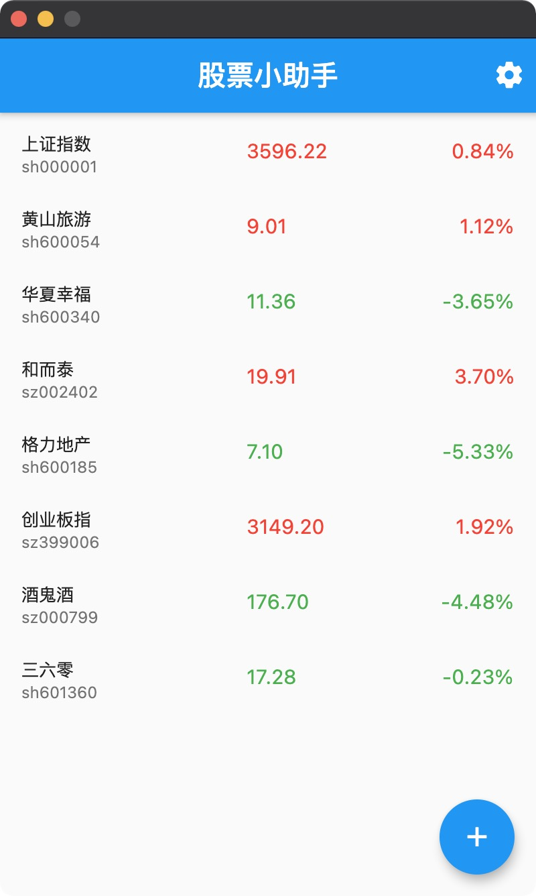
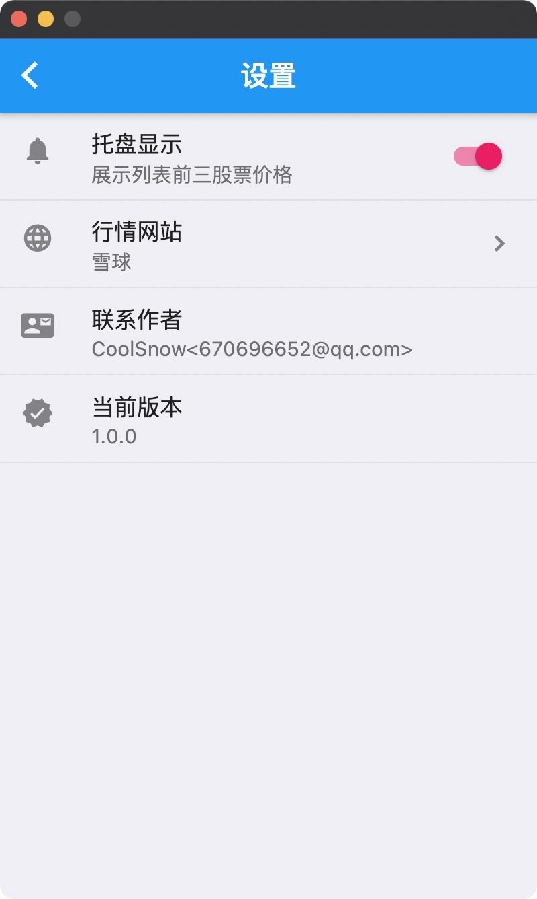

# 股票小助手
一款基于flutter，可以在系统托盘显示股票信息的macOS桌面应用，实乃小韭菜打工必备。

# 截屏

  
  
  

# 最新版本
[下载地址](https://github.com/RealCoolSnow/stock-helper/releases)

# 作者
CoolSnow 

Email: 670696652@qq.com

微博: https://weibo.com/670696652